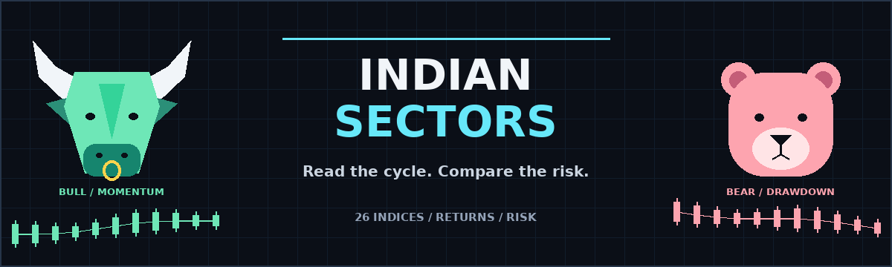
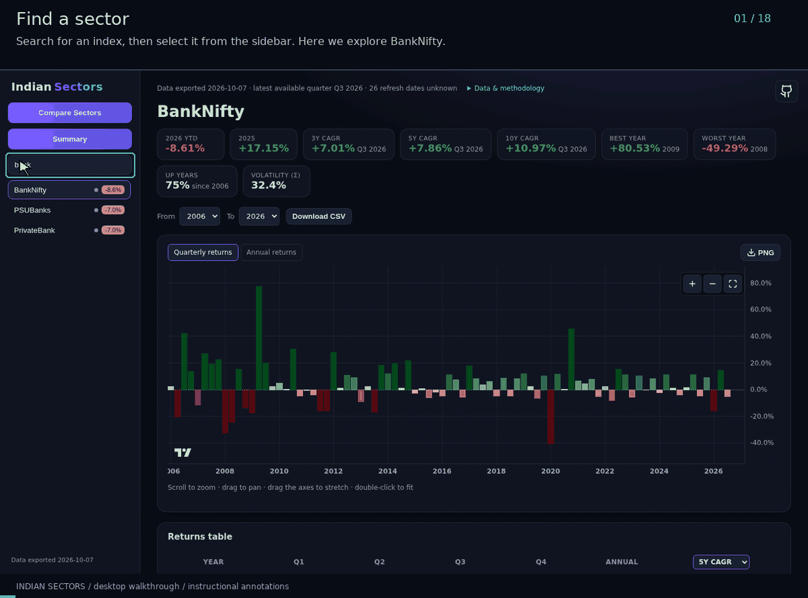
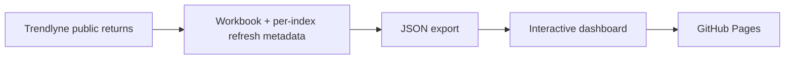

<p align="center">
  
</p>

<p align="center"><strong>Read the cycle. Compare the risk.</strong><br>
Learn sector rotation through Indian market returns, comparisons, and risk analysis.</p>

<p align="center">
  <a href="https://indianindices.github.io/">Open dashboard</a> &middot;
  <a href="https://indianindices.github.io/#compare">Compare Sectors</a> &middot;
  <a href="https://indianindices.github.io/#summary">Market summary</a> &middot;
  <a href="CONTRIBUTING.md">Contribute</a>
</p>

[](https://github.com/indianindices/indianindices.github.io/actions/workflows/update-data.yml)

**26 Indian indices. Seven comparison modes. Historical returns and transparent risk metrics.**
Explore Nifty50, sectoral, mid/small-cap and thematic indices in a browser.
No account or installation is needed to use the published dashboard.

[Dashboard](#dashboard) · [Comparison modes](#comparison-modes) · [Data and year rollover](#data-and-year-rollover) · [Methodology](#methodology) · [Local setup](#local-setup)

> A research and learning tool, not a trading forecast or investment recommendation.

## Dashboard



The 18-chapter walkthrough uses the real desktop dashboard, with captions and highlighted
controls: individual returns, comparison modes, year filters, sharing, rankings,
the annual heatmap, and CSV/PNG exports. It loops automatically; the captions and
highlights are tutorial annotations, not part of the application.

### Compare Sectors

The first navigation button opens the comparison workspace. Nifty50 and Next50
are selected initially; Nifty50 has a dashed line. Select individual indices
with checkboxes, or use **All / None**. Subtle button colours identify each metric.

**From / To** selects calendar years. The range is shared with asset pages,
but does not filter Summary. **Copy link** preserves the metric, selected indices
and years in the URL, including after reload. If clipboard access is unavailable,
a selectable link field appears instead.

### Individual indices

Search the sidebar or select an index to open its page. Each page includes:

- Quarterly and annual return histograms, with current-year annual values labelled **YTD**.
- YTD, previous-year return, 3Y / 5Y / 10Y CAGR, best/worst year, up-year frequency and annual volatility.
- A colour-graded returns table, with a **3Y / 5Y / 10Y CAGR** selector.
- Year-range filters and CSV download.

Missing or unfinished values remain blank. Stat tiles retain their full-history
definitions when the chart/table range changes. The fixed five-year average row
is shown only when the full year range is selected.

### Summary

Summary combines sortable index rankings, an all-index annual chart, an annual
heatmap and an automatically generated historical performance write-up.

- Rankings cover YTD, previous-year return, CAGR, volatility and up-year frequency.
- Click a column header to sort; click again to reverse direction. Missing values stay last.
- Returns default to highest first, volatility to lowest first. Index names open their pages.
- Hover the chart to rank legend entries for that year; hover an entry to highlight its line.
- Click legend entries to show/hide lines, or use **All / None**.
- Click an index in the heatmap to open its asset page.

Summary always uses all available data. The heuristic commentary is based on
past observations, **not a forecast**.

## Comparison modes

| Mode | What it measures | Important detail |
|---|---|---|
| Annual returns | Each calendar year's index return | Current year is YTD, not a completed year. |
| Growth of ₹10,000 | Completed quarterly returns compounded from a shared starting balance | Uses the latest uninterrupted history common to all selected indices. Changing the selection/range rebases every line. |
| Excess vs Nifty50 | Index annual return minus Nifty50's same-year return | **Percentage points**, not relative percentage gain: 20% minus 15% is +5 pp. Missing benchmark values remain blank. |
| 3Y / 5Y rolling CAGR | Annualized returns at each quarter-end using 12 or 20 consecutive quarters | Year filters select endpoints, not the preceding lookback. A missing quarter leaves a blank. |
| Drawdown | Decline from the running peak since the common starting date | Quarter-end observations only; daily or within-quarter losses may be worse. |
| Recovery (quarters) | Elapsed quarters below the previous peak, resetting to zero when it is regained | Risk tables include maximum/current drawdown, longest underwater duration, worst trough and worst-episode recovery, or **Not recovered**. |

The displayed common period defines growth, drawdown and recovery comparisons.
Risk modes use straight lines; other comparison curves are visual interpolation,
not extra market observations. Growth is hypothetical index performance without
fees, taxes or additional cash flows; dividends are not added separately.

## Chart controls and exports

The **+**, **−** and **fit-view** icons sit **inside the top-right of each graph**, beside the price axis.
Hover them for tooltips. PNG export and All/None remain outside the plot.

| Action | Control |
|---|---|
| Zoom | In-graph + / − icons, mouse wheel, or `+` / `-` keys |
| Pan | Click and drag the plot |
| Stretch | Drag the price or time axis |
| Fit | In-graph fit-view icon, double-click the plot, or `F` |
| Export data | **Download CSV** on asset and comparison pages |
| Export image | **PNG** on asset, Summary and comparison charts |

CSV files respect the selected indices, metric and year range; missing values
are empty. Growth files include the starting balance and quarter-end values in INR.
PNG files capture the **visible chart viewport**, not off-screen periods. They
include titles, period context, export date, source and visible-series legends.
Summary exports exclude hidden lines; empty comparison charts cannot export a PNG.

Direct links work for [Summary](https://indianindices.github.io/#summary),
[Compare](https://indianindices.github.io/#compare) and individual indices such as
[PSUBanks](https://indianindices.github.io/#asset/PSUBanks). Use **Copy link** for a
configured comparison. The top-right GitHub icon returns to this repository.

## Data and year rollover

Returns come from [Trendlyne](https://trendlyne.com/). A GitHub Actions workflow
is scheduled for the **3rd of every month**, and also runs on pushes to `main`
or through **Actions > Refresh data and deploy > Run workflow**.

The workflow fetches returns, exports website data, commits workbook changes
when returns or refresh metadata change, and deploys GitHub Pages.

### What happens next year?

**Year labels advance automatically after a new export and deployment.**
The export uses its actual calendar year, rather than a hard-coded year.
When the source supplies a new-year row, it appears as that year's **YTD**.
The outgoing year becomes a completed-year row or heatmap column, and ranking/stat
labels move to the new current year and previous year. Year selectors expand to
include the supplied years. This applies to each future year without annual code changes.

This is **not a midnight update** in an already-open browser. It requires a
new export/deployment and a page reload. Missing source years are not invented;
an index without a new-year source row has no new-year return yet. Completed
previous-year results also depend on the source having supplied the final values.
A saved comparison with explicit end dates intentionally keeps that range until changed.

## Methodology

| Metric | Definition |
|---|---|
| Quarterly / annual return | Reported by the source; the current year's annual value is YTD. |
| Stat-tile CAGR | Last 4 × N consecutive available quarterly returns, compounded and annualized. |
| Historical table CAGR | N consecutive calendar-year annual returns ending in the row year. |
| Current-year table CAGR | Trailing quarters through the latest available completed quarter. |
| Annual volatility | Sample standard deviation of completed calendar-year returns. |
| Up years | Share of completed years with strictly positive annual returns. |
| Summary risk-adjusted score | Mean annual return divided by annual volatility; **not a Sharpe ratio**. |

Source rounding, available history and missing observations limit precision.
The in-app **Data & methodology** section explains the calculations and assumptions.

## How it works



| File | Responsibility |
|---|---|
| [build_sectoraldata.py](build_sectoraldata.py) | Fetches returns, preserves cached data on failure, and writes workbook calculations and hidden `_RefreshStatus` metadata. |
| [export_data.py](export_data.py) | Exports JSON with the current calendar year, hides unfinished quarters, and rejects indices without usable history. |
| [index.html](index.html) | Sidebar and asset, comparison and Summary views. |
| [app.js](app.js) | Navigation, charts, calculations, rankings, sharing, CSV and PNG exports. |
| [style.css](style.css) | Responsive layout and visual theme. |
| [dev.sh](dev.sh) | Exports local data and serves the dashboard. |
| [.github/workflows/update-data.yml](.github/workflows/update-data.yml) | Scheduled refresh and Pages deployment. |

Charts use [TradingView Lightweight Charts](https://github.com/tradingview/lightweight-charts).
The in-graph and export icons are bundled [Lucide](https://lucide.dev/) assets.

## Local setup

Use Python with the project requirements (CI uses Python 3.12). Node.js 18+
is needed only for the JavaScript tests; no npm install or frontend build is required.

```bash
python3 -m venv .venv
source .venv/bin/activate
python -m pip install -r requirements.txt
./dev.sh
```

Open http://localhost:8000. Stop the server with Ctrl+C.
If that port is occupied, stop the existing preview or run `PORT=9000 ./dev.sh`.
Use `./dev.sh --refresh` only when you want to fetch live source data and rewrite
the workbook; ordinary startup exports the existing workbook without fetching.

### Checks

```bash
node --test tests/app.test.cjs
python3 -m unittest discover -s tests -p 'test_*.py'
git diff --check
```

Tests cover return calculations, comparison modes, rankings, export metadata,
share links, refresh fallbacks and year rollover. Python tests use mocked requests
and temporary workbooks; they do not fetch live data or modify the real workbook.

### Recreating the artwork

The banner is original artwork, not an illustration of actual index prices.
Its generator requires optional Pillow and a TrueType font; neither is needed
to run the dashboard. The default font path is DejaVu Sans Bold on Linux.

```bash
python -m pip install Pillow
python3 docs/make_banner.py
convert docs/brand.gif -layers Optimize docs/brand.gif
```

Use `--font /path/to/font.ttf` for a different font location. The generator
produces an optional animated banner and the static [header artwork](docs/brand.png)
used above. The desktop tutorial is the README's only embedded animation.

The tutorial assembler is [docs/make_tutorial.py](docs/make_tutorial.py). It uses
1440×900 screenshots of actual browser states, then adds captions and instructional
callouts; raw recording frames are not part of the deployment or repository.

## Contribute and support

Bug reports, data-quality fixes, accessibility work and focused features are
welcome. Read [CONTRIBUTING.md](CONTRIBUTING.md) for setup, tests and pull-request
guidelines. Report bugs through [GitHub Issues](https://github.com/indianindices/indianindices.github.io/issues).
Use the repository's **Sponsor** button to support the project.

**Past performance does not predict future returns. This project is not investment advice.**
