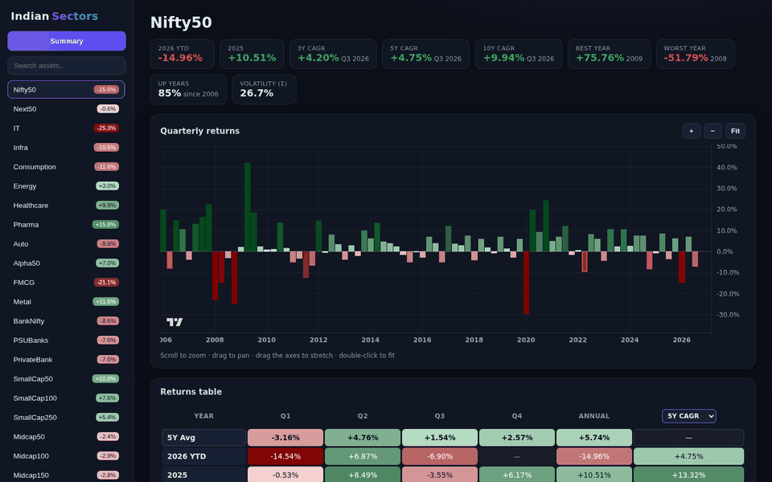
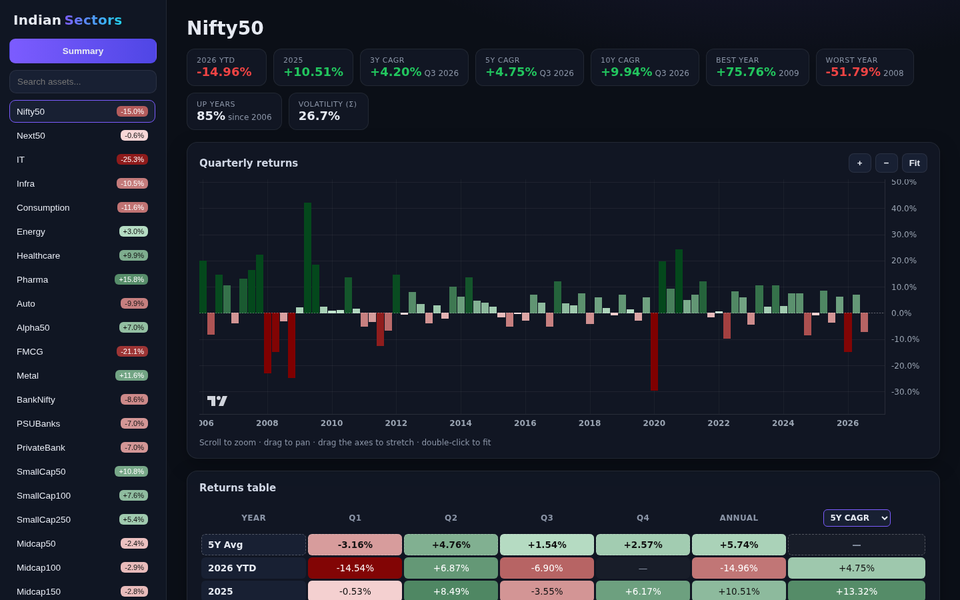
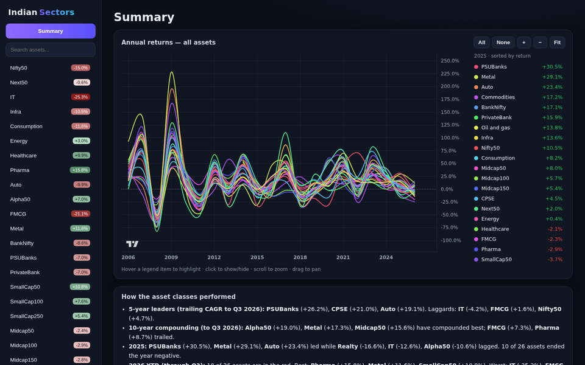
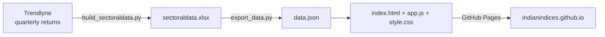

# Indian Sectors

**Quarterly and annual returns for 26 Indian market indices (Nifty50, sectoral, mid/small-cap and thematic), all in one interactive dashboard.**

### 👉 [Open the live site: indianindices.github.io](https://indianindices.github.io/)



The data refreshes automatically every month, so there's nothing to install. Just open the link.

---

## Using the site

### Asset pages
Pick any index from the sidebar (or type in **Search assets**). The coloured badge next to each name is its return so far this year.



- **Stat tiles**: this year's return so far (YTD), last year, the 3Y / 5Y / 10Y CAGR up to the last completed quarter, best and worst year, the share of years that ended positive, and volatility.
- **Quarterly returns chart**: one bar per quarter. Deep green bars are very strong quarters and deep red bars are very weak ones.
- **Returns table**: every year and quarter, colour-graded from dark red (very bad) through pale tones to dark green (very good).
  - Click the **5Y CAGR** header to switch between **3Y / 5Y / 10Y CAGR**.
  - Rows for past years show the calendar-year CAGR ending that year. The current-year row shows the **trailing** CAGR up to the last completed quarter, comparable to what Screener and similar sites report.
  - Unfinished quarters show as "—".

### Summary
Click **Summary** at the top of the sidebar.



- **Annual returns chart**: one curve per index.
  - Hover the chart to rank every index for that year in the legend on the right.
  - Hover a legend entry to highlight its curve, and click it to show or hide that curve. **All** / **None** toggle every curve at once.
- **How the asset classes performed**: an auto-generated write-up covering 5Y and 10Y leaders and laggards, last year, this year so far, the best risk-adjusted indices, and seasonality.
- **What may do well next**: simple rules applied to past returns, such as strong long-term indices that are down this year, indices with momentum, and indices whose recent trend has weakened. These are rules of thumb, **not a forecast and not investment advice**.
- **Annual heatmap**: every index × every year at a glance. Click an index name to open its page.

### Chart controls (TradingView-style)
| Action | How |
|---|---|
| Zoom | Mouse wheel / trackpad pinch, or the **+** / **−** buttons, or `+` / `-` keys |
| Pan | Click and drag |
| Stretch an axis | Drag the price or time axis |
| Fit everything | **Fit** button, double-click the chart, or press `F` |

Links can be shared: `#summary` and `#asset/<Name>` (e.g. [`#asset/PSUBanks`](https://indianindices.github.io/#asset/PSUBanks)) open the matching view directly.

---

## How it works



| File | Purpose |
|---|---|
| [build_sectoraldata.py](build_sectoraldata.py) | Fetches quarterly and annual returns for each index from Trendlyne and writes `sectoraldata.xlsx` (one sheet per index, plus a calculated 5Y CAGR column). If a fetch fails, it keeps that index's previously saved data instead of wiping it. |
| [export_data.py](export_data.py) | Converts the workbook into `data.json` for the website. It hides quarters that haven't finished yet, and it refuses to export if any index has no data, so a bad refresh is never published. |
| [index.html](index.html) | Page layout: sidebar, asset view and summary view. |
| [app.js](app.js) | Everything interactive: routing, charts ([TradingView Lightweight Charts](https://github.com/tradingview/lightweight-charts)), colour gradients, CAGR maths and the auto-generated summary. |
| [style.css](style.css) | Dark theme and layout. |
| [dev.sh](dev.sh) | Runs the site locally. |
| [.github/workflows/update-data.yml](.github/workflows/update-data.yml) | The monthly refresh and deployment. |

### How the numbers are calculated
- **Quarterly / annual returns** come straight from the source. The current year's "annual" value is year-to-date.
- **CAGR for a past year Y**: the annual returns from Y−N+1 through Y, compounded and annualised.
- **CAGR for the current year (and the stat tiles)**: the last 4·N quarterly returns up to the last completed quarter, compounded and annualised.
- **Risk-adjusted score**: average annual return ÷ standard deviation of annual returns.

### Automatic updates
A GitHub Actions workflow runs on the **3rd of every month** (and on every push to `main`). It:
1. fetches fresh data,
2. rebuilds `data.json`,
3. commits the refreshed `sectoraldata.xlsx` if the numbers changed,
4. deploys the site to GitHub Pages.

You can also start it manually from **Actions → Refresh data and deploy → Run workflow**.

---

## Run locally

```bash
pip install -r requirements.txt
./dev.sh             # serve the existing data at http://localhost:8000
./dev.sh --refresh   # fetch fresh data first
PORT=9000 ./dev.sh   # use a different port
```

## Notes
- Data source: [Trendlyne](https://trendlyne.com/). Availability depends on that site, so if a refresh is blocked the dashboard keeps showing the last good data.
- Past performance does not predict future returns. Nothing here is investment advice.
